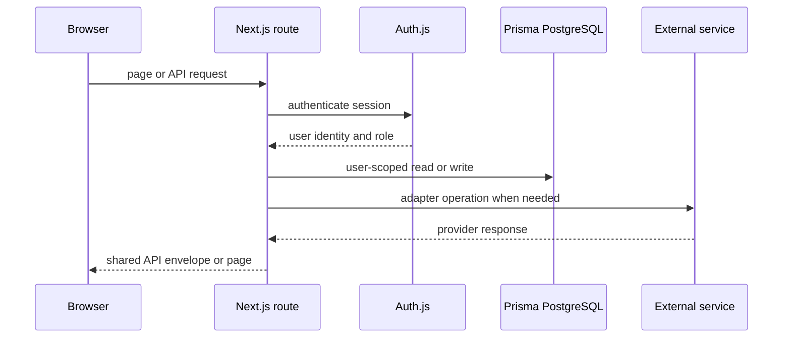

# Architecture overview

Sealion is one Next.js App Router application. Pages and route handlers live under [`src/app/`](../../src/app/); shared server/client utilities are under [`src/lib/`](../../src/lib/); reusable UI and hooks are under [`src/components/`](../../src/components/) and [`src/hooks/`](../../src/hooks/); external tracker orchestration is under [`src/services/`](../../src/services/).

## Request boundaries

Caption: A typical authenticated request crosses route, session, database, and optional remote-provider boundaries.

The root layout composes MUI, `next-intl`, global styling, and the application shell. Middleware in [`middleware.ts`](../../middleware.ts) checks `ADMIN` for `/admin/**` and `/api/admin/**`, but deliberately passes other API paths through. Therefore ordinary API handlers must call `auth()` and apply ownership predicates themselves.

## Authentication architecture

[`src/lib/auth/auth.ts`](../../src/lib/auth/auth.ts) builds the full Auth.js runtime configuration. Local credentials use bcrypt and reject pending, suspended, or passwordless users as appropriate. Enabled external providers are loaded from database configuration through [`src/services/auth-provider/`](../../src/services/auth-provider/).

The dynamic provider decision is recorded in [ADR 0002](../../docs/adr/0002-dynamic-auth-provider-loading.md): provider records are cached for 30 seconds and admin writes invalidate the cache. [ADR 0003](../../docs/adr/0003-reuse-authjs-account-table.md) explains why external links use Auth.js `Account` rows and why automatic dangerous email linking is not enabled. Session JWT claims carry user identity, role, and Gravatar preference; password changes are periodically rechecked to invalidate stale sessions.

## Persistence and security boundaries

[`src/lib/db/db.ts`](../../src/lib/db/db.ts) exposes a reused Prisma client backed by PostgreSQL. [`prisma/schema.prisma`](../../prisma/schema.prisma) is canonical for identity, board, issue, auth-provider, and SMTP settings. Sensitive provider credentials, IdP client secrets, and SMTP passwords are encrypted by [`src/lib/encryption/`](../../src/lib/encryption/); API responses must never expose them.

The [data model](../domain/data-model.md) defines the ownership chain and issue lifecycle. The [synchronization workflow](../workflows/synchronization.md) explains why remote calls and local writes are intentionally separated by the adapter/service layers.

## Change constraints

- Use the `@/*` alias for `src/*`; parent-relative imports are prohibited by project conventions.
- Validate inputs at API boundaries with the existing validation seams and return the shared `{ data, error, errorDetails? }` envelope.
- Keep provider-specific behavior in `src/services/issue-provider/` and IdP-specific behavior in `src/services/auth-provider/`.
- Localize user-visible strings in English and Japanese.
- Re-verify authorization in route handlers even when a page or middleware already checks it.
- Add an append-only ADR under [`docs/adr/`](../../docs/adr/) for consequential architectural decisions.
