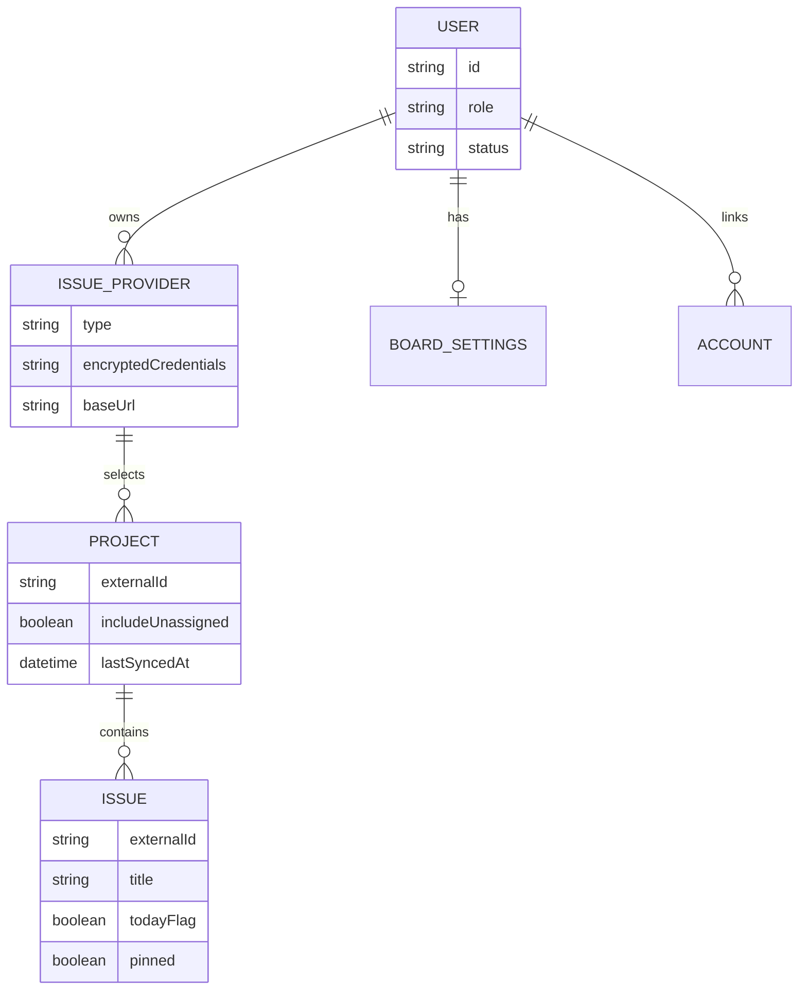

# Data model and task lifecycle

The persistence model in [`prisma/schema.prisma`](../../prisma/schema.prisma) separates user-owned work aggregation from global authentication administration.

## Ownership graph

Caption: Prisma relationships and the fields that drive ownership, synchronization, and board behavior.

`IssueProvider` belongs to a `User`; `Project` belongs to a provider; `Issue` belongs to a project. Queries that start from an issue must traverse this chain or otherwise constrain by the session user's provider ownership. Uniqueness is provider/project plus external project ID, and project plus external issue ID.

## What an issue means

An `Issue` is a local cache of an issue the adapter considers open. There is no local status field. Synchronization updates title, dates, URL, assignment state, and provider timestamps while preserving local `todayFlag`, `todayOrder`, `todayAddedAt`, and `pinned` board state. The [synchronization workflow](../workflows/synchronization.md) describes the authoritative remote reconciliation rule.

Completing an issue is not a local status transition: [`src/app/api/issues/[id]/route.ts`](../../src/app/api/issues/[id]/route.ts) decrypts the provider credentials, calls the remote close operation, optionally adds a comment, and deletes the local row only after the remote operation succeeds. The [provider integration contract](../integrations/providers.md) must therefore keep fetch and close external-ID formats compatible.

## Identity and administration

`User` has `USER` or `ADMIN` role and `PENDING`, `ACTIVE`, or `SUSPENDED` status. `BoardSettings` stores field visibility and sort order per user. `AuthProvider` stores runtime-configured Google, GitHub, Microsoft Entra, or generic OIDC settings; `AuthSettings` controls signup, verification, and session timeout; `SmtpSettings` supports verification and password-reset mail. Their secrets are encrypted. Auth.js `Account`, `Session`, and `VerificationToken` support authentication and account linking.

For the runtime consequences of these relations, see the [architecture overview](../architecture/overview.md). For board interaction and completion behavior, see [synchronization workflows](../workflows/synchronization.md).
