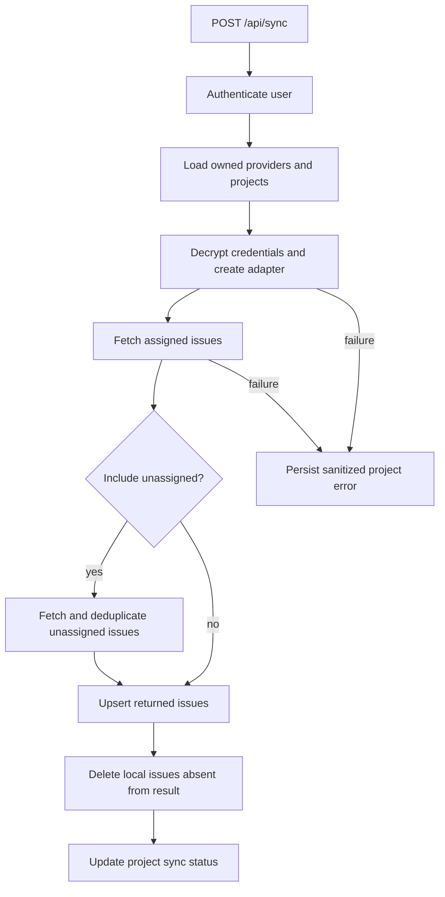

# Synchronization workflows

## Configure a connection

An authenticated user creates a provider through [`src/app/api/providers/route.ts`](../../src/app/api/providers/route.ts). The route validates the registry type and base URL, builds typed credentials, constructs the adapter, tests the remote connection, encrypts credentials, and saves the connection under the session user. Projects are then selected through the project APIs and stored with provider-scoped external IDs.

The provider adapter contract and supported tracker details are in [provider integrations](../integrations/providers.md). The [data model](../domain/data-model.md) explains why every project and issue access path is transitively user-owned.

## Reconcile open issues

Caption: The source-backed reconciliation path in `src/services/sync.ts` and `/api/sync`.

[`src/services/sync.ts`](../../src/services/sync.ts) limits work to 3 providers and 5 projects. It decrypts once per provider, fetches assigned issues, optionally merges unassigned issues while giving assigned records precedence, and performs upserts plus deletion in a transaction. The remote service is authoritative: a successful empty result deletes all local issues for that project. Adapters must return a complete set of intended open issues and must throw on incomplete pagination or remote failure.

Successful projects clear `syncError` and update `lastSyncedAt`. Failures preserve existing issues, store classified/sanitized project error information, update the timestamp, and are sorted deterministically for clients. Optional creation-date enrichment is best effort and retried in a later sync.

## Trigger, poll, and diagnose

`POST /api/sync` returns `202` immediately because synchronization runs in-process without awaiting completion. The dashboard polls `GET /api/sync` for project timestamps and errors. The 15-minute throttle in [`src/lib/sync/sync-utils.ts`](../../src/lib/sync/sync-utils.ts) uses persisted timestamps and baseline comparison to avoid clock-skew decisions. A `202` means started, not finished; inspect project status when diagnosing missing work.

## Board mutations

The dashboard and issue APIs keep local board state separate from remote issue state. Pinning and Today membership are local mutations. Today reordering uses transactional ordering logic. Completion calls the remote adapter and optionally posts a comment before deleting the local issue. If the remote operation fails, the local issue remains visible.

Changes to sync or completion should cover empty results, pagination, duplicate assigned/unassigned IDs, decryption errors, remote errors, ownership failures, and concurrency/order behavior. The [operations and testing guide](../operations/testing.md) maps those cases to test layers.
